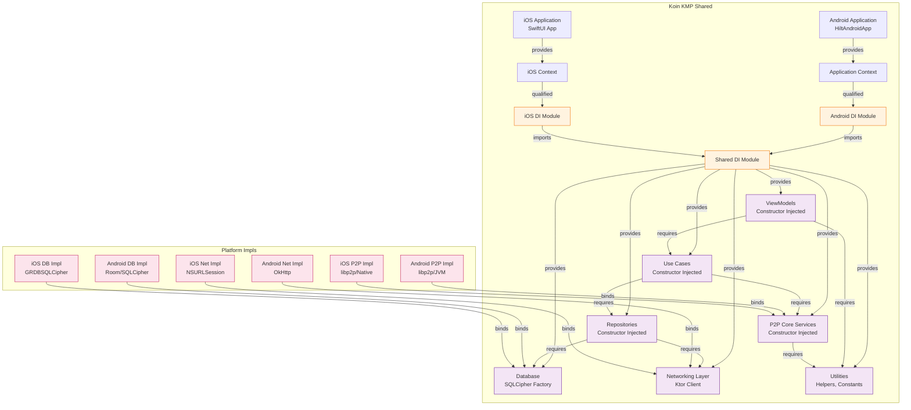

# NEO-P2P Cross-Platform Architecture Diagrams

## Layer Explanation Diagram

```mermaid
graph TD
    %% Platform-Specific Layers
    subgraph Android Platform
        AUI[Jetpack Compose UI<br/>Material 3] --> AViewModel[Shared ViewModel<br/>(AndroidX Lifecycle)]
        AViewModel --> AStateFlow[StateFlow/Flow<br/>State Observers]
    end
    
    subgraph iOS Platform
        IUI[SwiftUI UI<br/>Cupertino Adaptive] --> IViewModel[Shared ViewModel<br/>State Observers]
        IViewModel --> IState[Combine/Publishers<br/>State Observers]
    end
    
    %% Shared Layers
    subgraph Shared Module [Kotlin Multiplatform Shared]
        direction TB
        UIC[Use Cases<br/>(Interactors)] --> REPO[Repositories<br/>(Interfaces + Impl)]
        REPO --> P2P[P2P Core Layer<br/>libp2p • Nostr • Signal • WebRTC • LDK]
        P2P --> DATA[Data Layer<br/>Entities • DAOs • Local/Remote Sources]
        DATA --> DI[Dependency Injection<br/>Koin KMP or Manual]
        DI --> UTILS[Utilities<br/>Constants • Extensions • Helpers]
    end
    
    %% Connections
    AStateFlow -.->|State Collection| UIC
    IState -.->|State Subscription| UIC
    UIC -->|Triggers| REPO
    REPO -->|Queries/Commands| P2P
    P2P -->|Events/Data| DATA
    DATA -->|Provides| UIC
    
    %% Styling
    classDef platform fill:#E3F2FD,stroke:#1565C0,stroke-width:2px;
    classDef shared fill:#FFF3E0,stroke:#EF6C00,stroke-width:2px;
    classDef layer fill:#F3E5F5,stroke:#6A1B9A,stroke-width:1px;
    
    class AUI,AViewModel,IUI,IViewModel platform;
    class UIC,REPO,P2P,DATA,DI,UTILS shared;
    class AStateFlow,IState layer;
```

## Data Flow Diagram

```mermaid
sequenceDiagram
    participant User
    participant AndroidUI as Android UI<br/>(Jetpack Compose)
    participant iOSUI as iOS UI<br/>(SwiftUI)
    participant SharedVM as Shared ViewModel<br/>(KMP)
    participant UseCases as Use Cases<br/>(KMP)
    participant Repos as Repositories<br/>(KMP)
    participant P2PCore as P2P Core<br/>(KMP)
    participant LocalDB as Local Database<br/>(SQLCipher KMP)
    participant RemoteP2P as Remote P2P<br/>(libp2p/WebRTC/Nostr)
    
    %% User Interaction
    User->>AndroidUI: Tap "Create Offer"
    User->>iOSUI: Tap "Create Offer"
    
    %% Android Flow
    AndroidUI->>SharedVM: triggerCreateOffer()
    SharedVM->>UseCases: CreateOfferUseCase.execute(params)
    UseCases->>Repos: OfferRepository.save(offerDraft)
    Repos->>LocalDB: insert(offerEntity)
    LocalDB-->>Repos: offerId
    Repos-->>UseCases: offerId
    UseCases-->>SharedVM: Result.success(offerId)
    SharedVM->>AndroidUI: updateUIState(offerId)
    AndroidUI->>User: Show offer created screen
    
    %% iOS Flow (similar)
    iOSUI->>SharedVM: triggerCreateOffer()
    SharedVM->>UseCases: CreateOfferUseCase.execute(params)
    UseCases->>Repos: OfferRepository.save(offerDraft)
    Repos->>LocalDB: insert(offerEntity)
    LocalDB-->>Repos: offerId
    Repos-->>UseCases: offerId
    UseCases-->>SharedVM: Result.success(offerId)
    SharedVM->>iOSUI: updateUIState(offerId)
    iOSUI->>User: Show offer created screen
    
    %% P2P Broadcasting (runs in background)
    UseCases->>P2PCore: broadcastNewOffer(offer)
    P2PCore->>RemoteP2P: libp2p.publish(NostrEvent)
    RemoteP2P-->>P2PCore: Ack/Nack
    P2PCore-->>UseCases: BroadcastResult
    
    %% Real-time Updates (WebSocket/WebRTC)
    RemoteP2P->>P2PCore: Incoming Nostr Event<br/> (Offer Update/Message)
    P2PCore->>Repos: OfferRepository.updateFromEvent(event)
    Repos->>LocalDB: update(offerEntity)
    LocalDB-->>Repos: Success
    Repos-->>UseCases: Updated Offer
    UseCases-->>SharedVM: Flow.emit(updatedOffer)
    SharedVM->>AndroidUI: updateUIState(updatedOffer)
    SharedVM->>iOSUI: updateUIState(updatedOffer)
    
    %% Styling
    style User fill:#E8F5E8,stroke:#2E7D32
    style AndroidUI fill:#E3F2FD,stroke:#1565C0
    style iOSUI fill:#F3E5F5,stroke:#6A1B9A
    style SharedVM fill:#FFF3E0,stroke:#EF6C00
    style UseCases fill:#FFF3E0,stroke:#EF6C00
    style Repos fill:#FFF3E0,stroke:#EF6C00
    style P2PCore fill:#F3E5F5,stroke:#6A1B9A
    style LocalDB fill:#FCE4EC,stroke:#C2185B
    style RemoteP2P fill:#FCE4EC,stroke:#C2185B
```

## State Management Strategy Diagram

```mermaid
graph LR
    %% UI Layer
    subgraph UI Layer
        AUI[Android UI<br/>Jetpack Compose] -->|collectAsStateWithLifecycle()| AState[ViewModel State]
        IUI[iOS UI<br/>SwiftUI] -->|onSubscribe()| IState[ViewModel State]
    end
    
    %% ViewLayer
    subgraph ViewModel Layer [KMP Shared]
        direction TB
        AState -->|StateFlow<UIState>| VM[Shared ViewModel<br/>ViewModel()]
        IState -->|AsPublisher<UIState>| VM
        
        VM -->|_uiState = MutableStateFlow()/PassthroughSubject| StateHolder[State Holder<br/>MutableStateFlow/PassthroughSubject]
        StateHolder -->|map { transform }| ProcessedState[Processed State<br/>UI-specific transformations]
        ProcessedState -->|distinctUntilChanged()| SharedState[Shared State Flow<br/>StateFlow<UIState>]
        
        %% Business Logic Triggers
        VM -->|triggerEvent()| UseCases[Use Cases<br/>Interactors]
        UseCases -->|Result/Flow| StateHolder
    end
    
    %% Data Layer
    subgraph Data Layer [KMP Shared]
        Repos[Repositories] -->|Flow<List<Entity>>| StateHolder
        StateHolder -->|save()/update()| Repos
        Repos -->|DAO Operations| LocalDB[Local Database<br/>SQLCipher KMP]
        LocalDB -->|Flow<Entity>| Repos
    end
    
    %% Styling
    classDef ui fill:#E8F5E8,stroke:#2E7D32;
    classDef viewmodel fill:#FFF3E0,stroke:#EF6C00;
    classDef data fill:#F3E5F5,stroke:#6A1B9A;
    
    class AUI,IUI ui;
    class VM,StateHolder,ProcessedState,SharedState,UseCases viewmodel;
    class Repos,LocalDB data;
```

## Dependency Injection Diagram



## Folder Structure Diagram

```mermaid
graph TD
    neo-p2p[neo-p2p/] --> androidApp[androidApp/]
    neo-p2p --> iosApp[iosApp/] 
    neo-p2p --> shared[shared/]
    neo-p2p --> infrastructure[infrastructure/]
    neo-p2p --> docs[docs/]
    
    %% Android App
    androidApp --> src[src/]
    src --> main[main/]
    main --> java[java/]
    java --> com[com/]
    com --> neop2p[neop2p/]
    neop2p --> di[di/]
    neop2p --> domain[domain/]
    neop2p --> data[data/]
    neop2p --> ui[ui/]
    neop2p --> navigation[navigation/]
    neop2p --> service[service/]
    
    %% iOS App (SwiftUI)
    iosApp --> iosSrc[iosApp/]
    iosSrc --> Sources[Sources/]
    Sources --> App[App.swift]
    Sources --> Views[Views/]
    Sources --> ViewModels[ViewModels/] %% Observes shared ViewModels
    Sources --> Models[Models/] %% Shared models imported
    Sources --> Resources[Resources/]
    
    %% Shared Module (KMP)
    shared --> sharedSrc[src/]
    sharedSrc --> commonMain[commonMain/]
    sharedSrc --> androidMain[androidMain/]
    sharedSrc --> iosMain[iosMain/]
    
    %% Common Main (Pure Kotlin)
    commonMain --> kotlin[kotlin/]
    kotlin --> neop2pShared[neop2p/]
    neop2pShared --> model[model/] %% Data models, entities
    neop2pShared --> usecase[usecase/] %% Interactors
    neop2pShared --> repository[repository/] %% Repository interfaces
    neop2pShared --> viewmodel[viewmodel/] %% Shared ViewModels
    neop2pShared --> di[di/] %% Koin modules
    neop2pShared --> p2p[p2p/] %% P2P core interfaces
    neop2pShared --> networking[networking/] %% Networking interfaces
    neop2pShared --> database[database/] %% Database interfaces
    neop2pShared --> util[util/] %% Utilities, extensions
    
    %% Android Main (Platform-specific implementations)
    androidMain --> kotlin_android[kotlin/]
    kotlin_android --> neop2pAndroid[neop2p/]
    neop2pAndroid --> p2pImpl[p2pimpl/] %% libp2p, Nostr, Signal impl
    neop2pAndroid --> dbImpl[dbimpl/] %% Room/SQLCipher implementations
    neop2pAndroid --> netImpl[netimpl/] %% Platform networking
    neop2pAndroid --> utilImpl[utilimpl/] %% Android-specific utils
    
    %% iOS Main (Platform-specific implementations)
    iosMain --> kotlin_ios[kotlin/]
    kotlin_ios --> neop2pIos[neop2p/]
    neop2pIos --> p2pImpl[p2pimpl/] %% libp2p/Native bindings
    neop2pIos --> dbImpl[dbimpl/] %% GRDBSQLCipher implementations
    neop2pIos --> netImpl[netimpl/] %% Platform networking
    neop2pIos --> utilImpl[utilimpl/] %% iOS-specific utils
    
    %% Styling
    classDef root fill:#F5F5F5,stroke:#424242;
    classDef platform fill:#E3F2FD,stroke:#1565C0;
    classDef shared fill:#FFF3E0,stroke:#EF6C00;
    classDef source fill:#F3E5F5,stroke:#6A1B9A;
    classDef kotlin fill:#E8F5E8,stroke:#2E7D32;
    classDef impl fill:#FCE4EC,stroke:#C2185B;
    
    class neo-p2p root;
    class androidApp,iosApp,infrastructure,docs platform;
    class shared shared;
    class src,iosSrc,sharedSrc source;
    class main,Sources kotlin;
    class com,neop2p,neop2pShared kotlin;
    class di,domain,data,ui,navigation,service,model,usecase,repository,viewmodel,di,p2p,networking,database,util kotlin;
    class kotlin_android,kotlin_ios kotlin;
    class neop2pAndroid,neop2pIos kotlin;
    class p2pImpl,dbImpl,netImpl,utilImpl impl;
```

## Decision Summary

