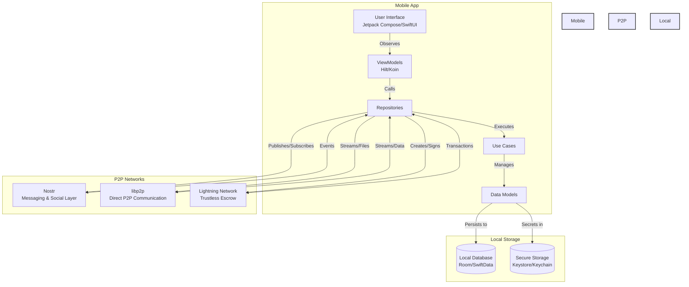

# NEO-P2P Architecture Overview

```mermaid
graph TD
    subgraph Mobile App
        UI[User Interface<br/>Jetpack Compose/SwiftUI]
        VM[ViewModels<br/>Hilt/Koin]
        REPO[Repositories]
        UC[Use Cases]
        MODEL[Data Models]
    end
    
    subgraph P2P Networks
        NOSTR[Nostr<br/>Messaging & Social Layer]
        LIBP2P[libp2p<br/>Direct P2P Communication]
        LN[Lightning Network<br/>Trustless Escrow]
    end
    
    subgraph Local Storage
        DB[(Local Database<br/>Room/SwiftData)]
        SECURE[(Secure Storage<br/>Keystore/Keychain)]
    end
    
    UI -->|Observes| VM
    VM -->|Calls| REPO
    REPO -->|Executes| UC
    UC -->|Manages| MODEL
    MODEL -->|Persists to| DB
    MODEL -->|Secrets in| SECURE
    
    REPO -->|Publishes/Subscribes| NOSTR
    REPO -->|Streams/Files| LIBP2P
    REPO -->|Creates/Signs| LN
    
    NOSTR <--->|Events| REPO
    LIBP2P <--->|Streams/Data| REPO
    LN <--->|Transactions| REPO
    
    style Mobile App fill:#f9f,stroke:#333,stroke-width:2px
    style P2P Networks fill:#bbf,stroke:#333,stroke-width:2px
    style Local Storage fill:#bfb,stroke:#333,stroke-width:2px
```
