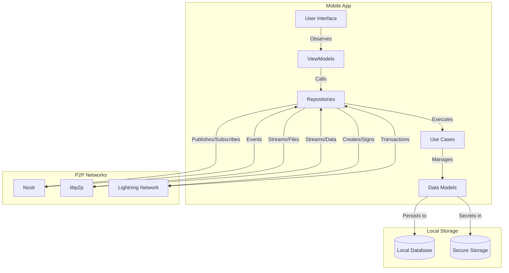

# NEO-P2P Architecture Overview

```mermaid
graph TD
    subgraph Mobile App
        UI[User Interface]
        VM[ViewModels]
        REPO[Repositories]
        UC[Use Cases]
        MODEL[Data Models]
    end
    
    subgraph P2P Networks
        NOSTR[Nostr]
        LIBP2P[libp2p]
        LN[Lightning Network]
    end
    
    subgraph Local Storage
        DB[(Local Database)]
        SECURE[(Secure Storage)]
    end
    
    UI -->|Observes| VM
    VM -->|Calls| REPO
    REPO -->|Executes| UC
    UC -->|Manages| MODEL
    MODEL -->|Persists to| DB
    MODEL -->|Secrets in| SECURE
    
    REPO -->|Publishes/Subscribes| NOSTR
    REPO -->|Streams/Files| LIBP2P
    REPO -->|Creates/Signs| LN
    
    NOSTR <--->|Events| REPO
    LIBP2P <--->|Streams/Data| REPO
    LN <--->|Transactions| REPO
```
