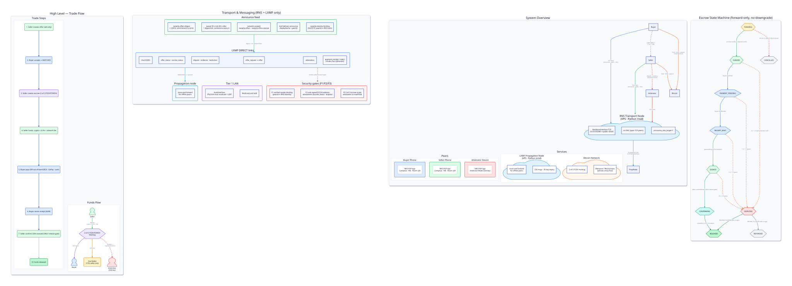

# NEO-P2P

**Zero-backend, pure Peer-to-Peer anonymous crypto seller app for Indonesia.**


---

## ⚡ The Problem

Centralized P2P exchanges (Paxful, Binance P2P) require:
- KYC/phone verification
- Central servers that can be shut down
- Transaction monitoring by third parties
- Fee enforcement that only works with a backend

**NEO-P2P solves this with zero servers.**

## 🔑 The Solution

| Feature | NEO-P2P | Centralized P2P |
|---------|---------|-----------------|
| Identity | Cryptographic keypair only | Phone/email/KYC |
| Infrastructure | Zero backend servers | Central databases |
| Fee enforcement | Pre-signed multisig (trustless) | Server-side deduction |
| Chat | E2EE (ChaCha20-Poly1305) | Server-mediated |
| Reputation | Signed attestations (local) | Central DB |
| Censorship resistance | Full (RNS + LXMF) | Vulnerable |

## 🏗 Architecture

NEO-P2P uses the Reticulum Network Stack (RNS) + LXMF messaging. Phones are client-only (TCP clients to a VPS transport node); the transport node routes announces/paths/links, and a Python LXMF propagation node provides store-and-forward for offline peers:

| Role | Components |
|------|-----------|
| **Buyer Phone** | On-chain Wallet, RNS/LXMF, E2EE Chat |
| **Seller Phone** | On-chain Wallet, RNS/LXMF, E2EE Chat |
| **Discovery** | RNS announces (`neop2p/offers` digest feed) |
| **Transport** | RNS (TCP client → VPS transport node, official Python rnsd) |
| **Messaging** | LXMF (DIRECT links + propagation node for offline) |
| **Escrow** | 2-of-3 Multisig (bitcoinj on-chain) |
| **Fee** | Hardcoded Native SegWit address (`bc1qdfs8ucu...`) |

- **RNS** routes announces, paths, and links between peers (replaces libp2p + WS relay + Nostr)
- **LXMF** carries chat, offer status, escrow sync, and arbitration signaling (replaces Nostr kinds + WebRTC)
- **E2EE chat** — X25519 ECDH + HKDF-SHA256 + ChaCha20-Poly1305 (NIP-44-inspired) encrypts all messages end-to-end
- **2-of-3 multisig** holds funds until fiat payment is confirmed
- **Arbitrator** holds the 3rd key, resolves disputes via signed evidence

Full pre-rendered SVG:



Render the D2 source yourself:
```
d2 ARCHITECTURE_DIAGRAMS.d2 output.svg
```

## 🚀 Quick Start

### Prerequisites
- Android Studio or IntelliJ IDEA
- **JDK 21** (pinned machine-wide; AGP 9.3.0 rejects newer JDKs)
- Android SDK 36 (`targetSdk`), min SDK 26
- Gradle 9.5.0 (via `android/gradlew` wrapper)

> Build gotcha: if AGP fails with a Java version error, pin JDK 21 via
> `org.gradle.java.home` in `~/.gradle/gradle.properties` (see `AGENTS.md`).

### Build
```bash
cd android
./gradlew assembleDebug
```

### Install on device
```bash
./gradlew installDebug
```

### Deploy RNS Infrastructure 
You can build your own reticulum:
## config example:
```
[reticulum]
enable_transport = Yes
share_instance = no
panic_on_interface_error = No
discover_interfaces = yes

[logging]
loglevel = 4

[interfaces]

   [[VPS TCP Server]]
     type = BackboneInterface
     enabled = Yes
     listen_ip = 0.0.0.0
     listen_port = 42000
     mode = gateway
     discoverable = no
 
```

## 📱 Screens

| Screen | Description |
|--------|------------|
| **Onboarding** | 5-step: Welcome → Create Identity → Backup Seed → Verify Seed → Finish |
| **Home** | Offer feed with pull-to-refresh, peer reputation |
| **Create Offer** | Sell BTC (sell-only), market-price default, fiat method + bank details, edit/delete own offer |
| **Offer Detail** | Full trade summary, fee breakdown, peer profile, chat entry for locked trades |
| **Chat** | E2EE messages, Room history, pre-key handshake over LXMF |
| **Wallet** | Personal BIP-44 wallet: receive QR + copy, balance, history, send (UTXO-selected raw tx) |
| **Escrow** | 2-of-3 multisig state machine |
| **Trade Room** | Post-accept Escrow+Chat hub (status header + role-adaptive shortcuts) |
| **Dispute Evidence** | Upload bank receipts and evidence for arbitration |
| **Profile** | Keypair display, nickname editing, reputation stats |
| **Settings** | RNS transport status, Tor (coming soon), identity reset |

## 💰 How the 0.5% Fee Works (No Server Required)

This is the key innovation in NEO-P2P:

1. **Seller deposits** `crypto amount + 0.5% fee + network fee` into a 2-of-3 P2SH multisig
2. **Buyer pays IDR** via the selected fiat method (BCA, GoPay, etc.) — the buyer pays **no fee** and receives the **full crypto amount**
3. **Both parties pre-sign** a payout transaction: full crypto → buyer, 0.5% → fee wallet
4. **Only the seller pays the fee** (0.5%); the miner fee is budgeted separately via a dynamic network fee
5. **Pre-signing happens BEFORE** any fiat money moves
6. **Neither party can cheat** — both signatures are needed to broadcast
7. **On IDR confirmation**, the pre-signed tx broadcasts atomically

The fee wallet address is **signature-protected** — only the project owner (holding the Ed25519 private key) can change it. Any fork that alters it is blocked from creating escrow. Since 2026-09-07 a **payout-destination gate** additionally rejects any payout that would send the buyer's sats to the fee wallet or back into the escrow's own multisig — at accept and at build.

## 🌐 Fiat Methods Supported

### Bank Transfer
- BCA
- Mandiri
- BNI
- BRI

### E-Wallet
- GoPay
- OVO
- Dana
- ShopeePay
- LinkAja

### Cash
- Cash Meetup (Tunai)

## 🧩 Tech Stack

| Layer | Technology | Purpose |
|-------|------------|---------|
| **Identity** | BIP-39 mnemonic + BIP-32/SLIP-10 derivation (Android KeyStore) | Hardware-backed seed, no KYC |
| **Discovery** | RNS announces (`neop2p/offers` digest feed) | Trade offer broadcast |
| **Transport** | RNS (rns-core, TCP client → VPS transport node) | Authenticated P2P routing |
| **Messaging** | LXMF (lxmf-core, DIRECT links + propagation node) | Chat + signaling, offline store-and-forward |
| **Chat** | ChaCha20-Poly1305 (X25519 ECDH + HKDF-SHA256) | End-to-end encrypted |
| **Files** | LXMF file attachments (auto-Resource) | Payment proof P2P transfer |
| **Escrow** | bitcoinj 2-of-3 multisig (testnet on main; mainnet on the v0.1.0-beta-1 release) | Trustless, pre-signed payout |
| **Reputation** | Signed attestations (local-only) | No central database |
| **Storage** | Room + SQLCipher (`sqlcipher-android` 4.17, 16 KB-aligned) | Encrypted offline-first local DB |
| **UI** | Jetpack Compose + Material 3 | Modern Android UI |
| **DI** | Dagger Hilt | Dependency injection |
| **Theme** | Dark cyber-green | Anonymous trader aesthetic |

## 🔒 Security & Privacy

- **No phone, email, or name** ever required
- **No account creation** — just a cryptographic key
- **No central servers** — all data is peer-shared or on-device
- **E2EE chat** — X25519 ECDH + HKDF-SHA256 + ChaCha20-Poly1305 (custom, NIP-44-inspired; not NIP-44/59 wire-compatible), keys derived from your BIP-39 mnemonic
- **Offline-first** — Room DB encrypted with SQLCipher
- **Tor support** — optional routing through Tor for maximum anonymity (planned v3.0)
- **Open source** — all code auditable, fee address hardcoded

## 📖 User Manual

- **English:** [manual/USER_MANUAL.md](manual/USER_MANUAL.md)
- **Bahasa Indonesia:** [manual/USER_MANUAL_ID.md](manual/USER_MANUAL_ID.md)

## 🤝 Contributing

See [CONTRIBUTING.md](CONTRIBUTING.md) for guidelines.

1. Fork the repo
2. Create your feature branch: `git checkout -b feature/amazing-feature`
3. Commit: `git commit -m 'Add amazing feature'`
4. Push: `git push origin feature/amazing-feature`
5. Open a PR

## 📜 License

MIT — use it, modify it, build on it. See [LICENSE](LICENSE).  
The fee wallet address is the only hardcoded constant — change it to your own before building.

**Third-party licenses:** this project embeds forks of [Reticulum](https://github.com/markqvist/Reticulum) and [LXMF](https://github.com/markqvist/LXMF) (MPL-2.0). See [THIRD_PARTY_NOTICES.md](THIRD_PARTY_NOTICES.md) for full compliance details.

## ⚠️ Disclaimer

NEO-P2P is experimental software. Cryptocurrency trading carries financial risk.  
This tool is provided "as is" without warranty. Use at your own risk.  
Always verify the fee wallet address in the open-source code before using.

Full risk warning (English + Bahasa Indonesia): [disclaimer.md](disclaimer.md)

---

*Built with ❤️ for the Indonesian P2P crypto community.*
